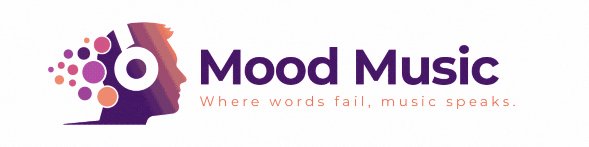

  <h1 align="center">Mood Music</h1>

  

    
    
    
    
  

  
  

## Description:

Mood Music is an application which enables users to couple their love of astrology and music. It was built to cater to an individual who is interested in receiving their daily horoscope, has a desire to hear new and exciting music associated with their zodiac sign, and to provide this in one, easy to navigate application. The core functionality of the application is minimal, providing the user what they what and nothing that they don't need. The stying of the application is meant to be bold, welcoming, and simple, allowing the user to interact with the application interface in a meaningful way while reducing potential distraction or navigational confusion. The Spotify API ensures that users are being exposed to a wide array of high quality artists that align with their zodiac traits, with the ultimate goal of providing a means to unearth a hidden gem.

## Table of Contents:

- [Live App](#installation)
- [Usage](#usage)
- [Contributing](#contributing)
- [Questions?](#tests)
- [Creators](#questions)

## Live App:

> https://mewd-mewsic.herokuapp.com/

## Usage:

A user can create an account or log in to an existing account and be presented with their daily horoscope, along with three artists from various genres that were thoughtfully curated based on traits associated with each zodiac sign. The user can then proceed to click on the card of an artist that they are interested in and explore that artist's music on Spotify.

## Contributing:

If you have a great idea to enhance our application or have any suggestions for improvement, please feel free to create a pull request for us to review.

## Questions?:

If you have any questions, comments, or concerns, please feel free to connect with us via Github and we'll be in touch as soon as possble.

## Creators:

- :octocat: [Alicia Vega](https://github.com/aliciavega731) 
- :octocat: [Emily Marshall](https://github.com/emarshall121) 
- :octocat: [Garrett Warzecha](https://github.com/gwarzecha) 
- :octocat: [Justin Beard](https://github.com/ATXiceman512) 

## License:

This project is covered under the MIT license.
